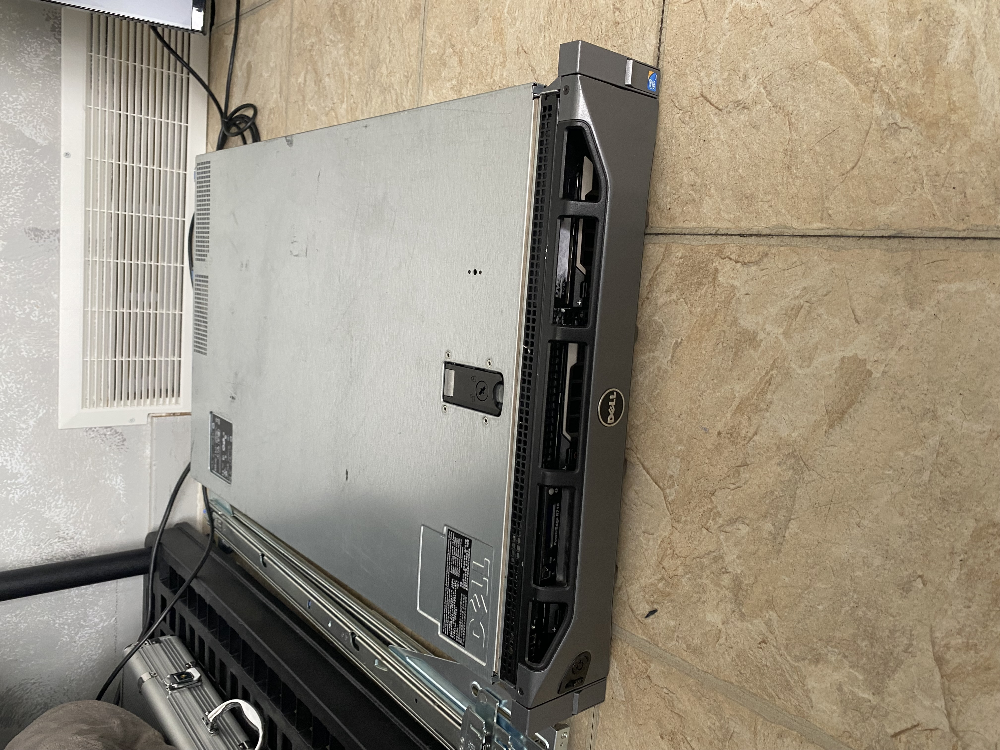
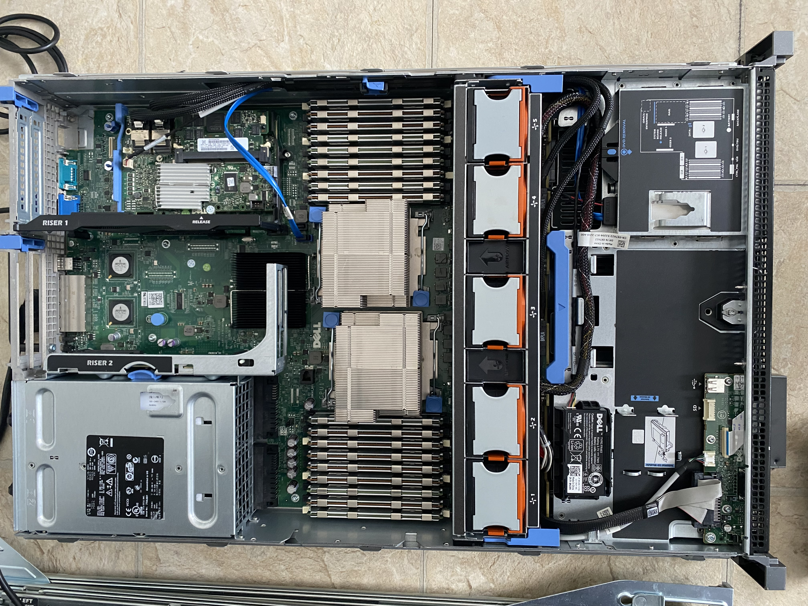

# Hardware Information about my Dell R710

  
  

## Overview
This server is currently used as a virtualization and Active Directory lab machine.

## Hardware Specs

CPU: 2x Xeon X5650 @ 2.67 GHz
RAM: 144GB DDR3 ECC  
RAID: PERC H700
Drives: 6x SAS - Not currently used 

## Planned Usage

- Active Directory Domain Controller
- Virtual networking labs
- CCNA practice environment

## Lab Log

### 2026 Febuary
- Purchased server
- Verified POST
- Checks Caddys, CPU, RAM and condition

- Powered on for first full inspection
- Entered BIOS
- Verified RAID configuration
